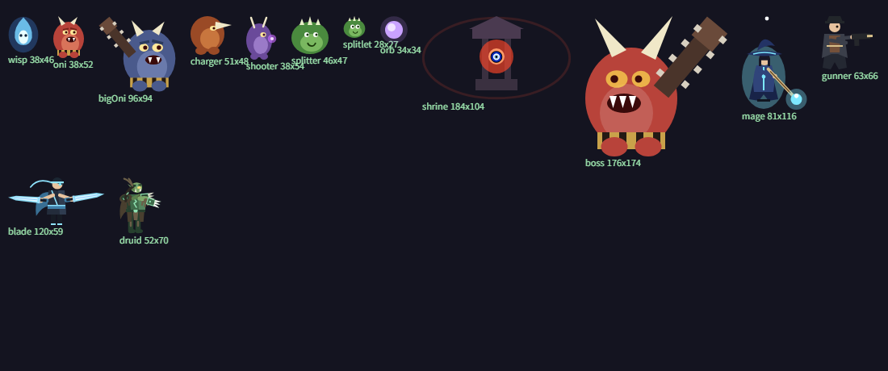

# 프로토타입 그림 가져오기 (임시 스프라이트)



## 원본에는 이미지 파일이 하나도 없다

`reference/project_test.html`을 뒤져보면 이렇다:

| 찾은 것 | 개수 |
|---|---|
| `data:image` / base64 | 0 |
| `` / `new Image()` | 0 |
| `.png` / `.jpg` / `.svg` 참조 | 0 |

캐릭터·몹·성소·보스가 전부 **Canvas 2D 드로잉 코드**로 그려진다(`:4482`~`:6215`, 1734줄).
사운드도 파일이 아니라 WebAudio 오실레이터로 실시간 합성한다(`sfx()` `:1082`).

즉 **"에셋 폴더를 복사해 온다"는 게 애초에 불가능하다.** 대신 그리는 코드를 실행시켜
결과를 PNG로 구워냈다.

## 어떻게 구웠나

1. 원본을 로컬 HTTP로 띄운다 (`file://`로는 JS가 안 돈다).
2. 페이지 안에서 `ctx`를 지우고 → `draw*()` 하나를 호출하고 → **투명하지 않은 영역만 자동으로
   잘라내서** `canvas.toDataURL('image/png')`.
   - JS가 단일 스레드라 **한 번의 동기 실행 안에서** 지우고·그리고·캡처하면 게임의 `requestAnimationFrame`
     루프가 중간에 끼어들지 않는다. (화면으로 확인하려 하면 다음 프레임에 덮어써져서 안 보인다 —
     굽는 것 자체는 멀쩡하다.)
   - 크기를 손으로 맞추지 않고 알파 바운딩박스로 자동 크롭했다. 종류마다 뿔·무기 때문에
     실제 그려지는 크기가 `CONFIG.enemyBase`의 `w`/`h`와 다르다.
3. 잘라낸 PNG를 로컬 수신 서버로 POST해서 `Assets/Sprites/Prototype/`에 저장.

> 굽는 스크립트와 수신 서버는 **저장소에 남기지 않았다**(일회성 도구, scratchpad에서 실행).
> 다시 뽑아야 하면 이 문서의 절차를 그대로 반복하면 된다.

## 결과

| 파일 | 크기(px) | 비고 |
|---|---|---|
| `enemy_wisp` | 36×46 | |
| `enemy_oni` | 38×52 | |
| `enemy_bigoni` | 96×94 | |
| `enemy_charger` | 51×48 | |
| `enemy_shooter` | 37×54 | |
| `enemy_splitter` | 46×47 | |
| `enemy_splitlet` | 28×27 | |
| `shrine` | 184×104 | 붉은 오라 링이 같이 들어가 있다 |
| `boss` | 176×174 | |
| `exp_orb` | 34×34 | |
| `char_mage` | 81×116 | 지팡이·구슬 포함 |
| `char_gunner` | 63×66 | |
| `char_blade` | 120×59 | **베는 자세**로 굳어 있다(idle 포즈가 따로 없다) |
| `char_druid` | 52×70 | |

## Unity 쪽 설정

- `Assets/Editor/BuildPrototypeSprites.cs` — import 설정을 코드로 맞춘다(손으로 찍지 않는다).
  **PPU 100** — 이 프로젝트 월드 스케일이 100px = 1유닛이라 원본과 정확히 같은 크기로 들어온다.
- `EnemyData.sprite` — 종류별 그림. `BuildEnemyData`가 연결한다.
- `PlayerRig.characterSprites` — 캐릭터별 그림. 선택할 때 갈아끼운다.

### ⚠️ 크기 보정이 왜 필요한가

콜라이더와 스프라이트가 **같은 GameObject**에 있어서 `localScale`이 둘 다에 걸린다.
그래서 스케일 하나로 그림 크기를 맞추고, **콜라이더 `radius`를 역으로 나눠 월드 반지름을 유지**한다:

```
월드 반지름 = radius × scale   →   radius = 원하는반지름 / scale
```

이 보정을 빼면 둘 중 하나는 반드시 어긋난다 — 그림이 히트박스보다 작아 보이거나(맞았는데 안 맞은 것 같음),
플레이어 쪽은 지면 판정·발판 착지가 통째로 틀어진다.
(`EnemySpawner.ApplySize`, `PlayerRig.ApplySprite`)

## 알려진 한계

- **정지 포즈 한 장씩이다.** 원본은 `e.walk`·`player.walkCycle`로 걷기/공격 애니메이션을 매 프레임
  계산한다. 애니메이션이 필요하면 같은 방법으로 프레임을 여러 장 구워 스프라이트 시트로 만들면 된다.
- **섬영은 베는 자세로 굳어 있다** — `drawBlade`가 항상 검을 그린다.
- **크기 관계는 원본과 다르다.** 우리 콜라이더가 원본보다 크게 잡혀 있어서(기존에 알고 있던 계통 편차,
  `docs/original-parity.md` 8-1절) 그림을 히트박스에 맞춰 키워 놓았다. 절대 크기를 원본에 맞추려면
  콜라이더부터 줄여야 하고, 그건 스폰 높이·충돌·테스트가 한꺼번에 흔들리는 별도 작업이다.
- **정식 아트로 갈아끼울 때**: 같은 파일명으로 PNG만 덮어쓰고 `YokaiFront/Import Prototype Sprites`를
  한 번 실행하면 된다. 코드는 바뀌지 않는다.
